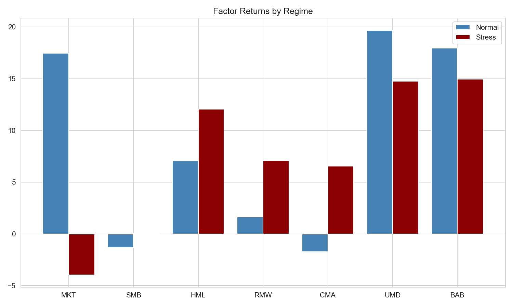
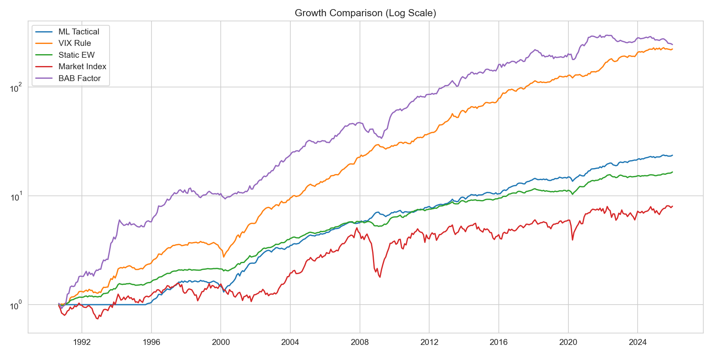
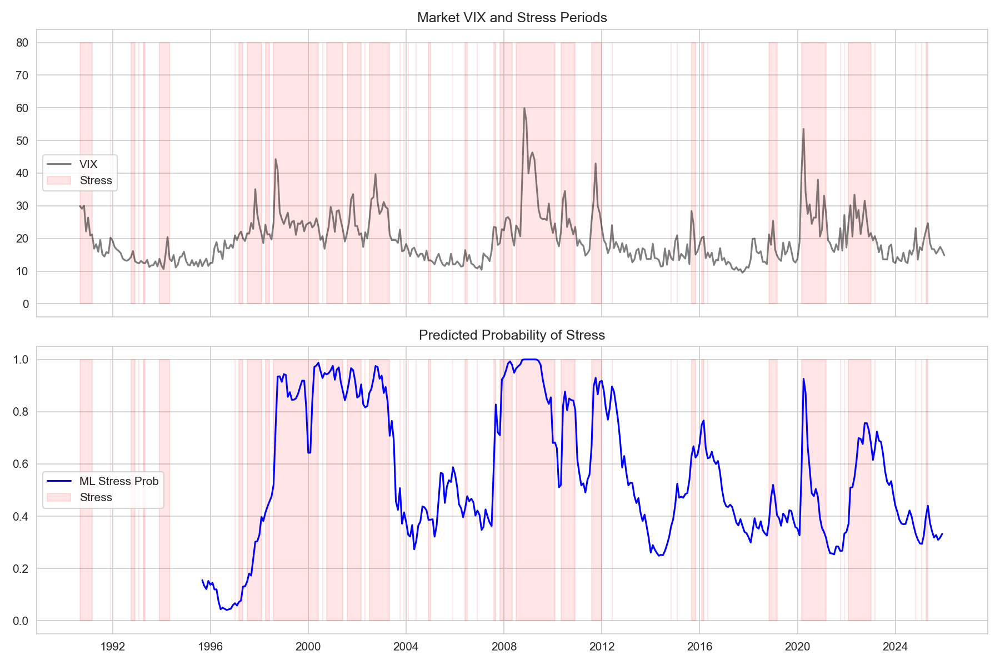
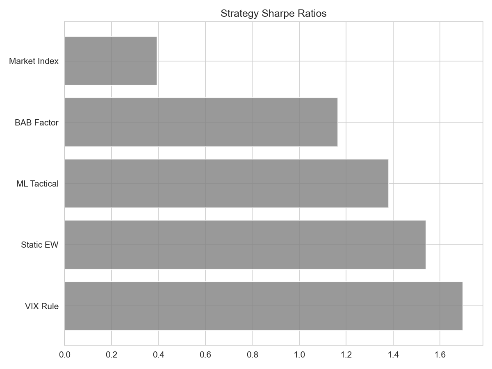

# Regime-Dependent Factor Investing

<p align="center">
  <strong>A regime-aware quantitative research project for testing whether factor exposure should change with market stress.</strong>
</p>

<p align="center">
  <a href="#research-thesis">Research Thesis</a> |
  <a href="#methodology">Methodology</a> |
  <a href="#results">Results</a> |
  <a href="#run-the-project">Run the Project</a>
</p>

---

## Overview

Traditional factor portfolios often assume that factor premia are reasonably stable through time. This project tests a more conditional view: factor returns may behave differently in normal markets versus stressed markets, so allocation rules should adapt to the market regime.

The workflow combines equity factor data, volatility signals, macro-financial stress indicators, GARCH volatility modeling, and a walk-forward logistic model to compare static and regime-aware factor allocation strategies.

## Research Thesis

If volatility and credit conditions contain useful information about market state, then a factor strategy can potentially improve risk-adjusted performance by rotating between offensive and defensive factors.

This repository evaluates that thesis through:

- Regime classification using VIX and GARCH-implied volatility stress.
- Factor-level performance attribution across normal and stress regimes.
- A VIX-threshold switching strategy.
- A machine-learning tactical allocation strategy using macro stress predictors.
- Benchmark comparisons against equal-weight factors, the market factor, and BAB.

## Data Inputs

The project uses monthly data from the following sources:

| Dataset | File | Role |
| --- | --- | --- |
| AQR factor data | `Script & Data/Betting Against Beta Equity Factors Monthly.xlsx` | BAB, market, momentum, value, size, and risk-free data |
| Fama-French 5 factors | `Script & Data/F-F_Research_Data_5_Factors_2x3.csv` | Profitability and investment factors |
| CBOE VIX | `Script & Data/VIXCLS.csv` | Volatility regime signal |
| FRED macro series | API via `fredapi` | Credit spread, term spread, and financial conditions predictors |

The script expects a `FRED_API_KEY` in `.env` when fetching FRED data.

## Methodology

### 1. Data Alignment

Factor, volatility, and macro series are cleaned, converted to month-end observations, and merged into a single monthly panel.

### 2. Regime Definition

The project classifies stress months using:

- A VIX rule: `VIX > 20`.
- A GARCH volatility signal: rolling z-score of GARCH conditional volatility.
- A combined stress flag when either volatility condition is active.

### 3. Factor Diagnostics

Each factor is evaluated separately across normal and stress regimes. The analysis estimates annualized returns, Sharpe ratios, and the return gap between regimes.

### 4. Walk-Forward Stress Prediction

A logistic regression model estimates next-month stress probability using:

- `BBB_SPREAD`
- `TERM_SPREAD`
- `NFCI`

The model is trained in a walk-forward setup to avoid using future observations in historical predictions.

### 5. Strategy Evaluation

The project compares:

- `VIX Rule`: switches between offensive and defensive factor baskets using the VIX threshold.
- `ML Tactical`: blends offensive and defensive baskets using predicted stress probability.
- `Static EW`: equal-weight allocation across all factors.
- `Market Index`: market factor benchmark.
- `BAB Factor`: standalone betting-against-beta benchmark.

## Results

Current generated results from `strategy_performance.csv`:

| Strategy | Annual Return | Annual Volatility | Sharpe | Max Drawdown |
| --- | ---: | ---: | ---: | ---: |
| VIX Rule | 15.81% | 9.32% | 1.70 | -28.16% |
| Static EW | 8.09% | 5.26% | 1.54 | -11.33% |
| ML Tactical | 9.19% | 6.66% | 1.38 | -21.88% |
| BAB Factor | 16.63% | 14.28% | 1.16 | -28.29% |
| Market Index | 8.02% | 20.38% | 0.39 | -64.86% |

In this run, the VIX-based switching strategy produced the strongest Sharpe ratio, while the market benchmark experienced materially higher volatility and drawdown.

## Visual Results

### Factor Returns by Regime

<p align="center">
  
</p>

### Cumulative Growth Comparison

<p align="center">
  
</p>

### Regime Timeline and Stress Prediction

<p align="center">
  
</p>

### Sharpe Ratio Comparison

<p align="center">
  
</p>

## Repository Structure

```text
.
|-- README.md
|-- Plots/
|   |-- chart1_factor_regime_performance.png
|   |-- chart2_cumulative_returns.png
|   |-- chart3_regime_timeline.png
|   `-- chart4_sharpe_comparison.png
`-- Script & Data/
    |-- Regime Factor Investing.py
    |-- Betting Against Beta Equity Factors Monthly.xlsx
    |-- F-F_Research_Data_5_Factors_2x3.csv
    |-- VIXCLS.csv
    |-- factor_regime_analysis.csv
    |-- predictions_GARCH.csv
    `-- strategy_performance.csv
```

## Run the Project

### Prerequisites

Install the core Python dependencies:

```bash
pip install pandas numpy matplotlib seaborn statsmodels scikit-learn arch fredapi python-dotenv openpyxl
```

Create a `.env` file in the repository root:

```bash
FRED_API_KEY=your_fred_api_key
```

### Execute

The script reads its input files from the current working directory, so run it from `Script & Data`:

```bash
cd "Script & Data"
python "Regime Factor Investing.py"
```

The script writes CSV outputs and plot files to the working directory used at runtime. The repository also includes curated plot exports under `Plots/` for README display.

## Output Files

| Output | Description |
| --- | --- |
| `factor_regime_analysis.csv` | Factor-level normal versus stress regime statistics |
| `predictions_GARCH.csv` | Walk-forward next-month stress probability estimates |
| `strategy_performance.csv` | Annualized return, volatility, Sharpe, and drawdown by strategy |
| `chart1_factor_regime_performance.png` | Factor returns by regime |
| `chart2_cumulative_returns.png` | Strategy growth comparison |
| `chart3_regime_timeline.png` | VIX, stress periods, and ML stress probability |
| `chart4_sharpe_comparison.png` | Strategy Sharpe ratio comparison |

## Key Takeaways

- Factor performance is meaningfully regime-dependent in the current sample.
- Volatility-aware allocation improved Sharpe ratio versus the static factor portfolio in this run.
- Defensive factors such as profitability and investment showed stronger behavior during stress regimes.
- The ML tactical approach provides a useful framework, but the simple VIX rule performed better in the current implementation.

## Future Work

- Add transaction costs, turnover, and slippage assumptions.
- Expand regime definitions using inflation, liquidity, and macro growth indicators.
- Add benchmark-relative performance and statistical significance tests.
- Refactor the script into reusable modules or a notebook-based research pipeline.
- Add out-of-sample robustness checks across alternative factor universes.

## Disclaimer

This project is for quantitative research and educational purposes only. It is not investment advice, and historical backtest results do not guarantee future performance.
